# 📊 Multiple Linear Regression: The Complete Guide

> **The Evolution:** From predicting with ONE feature to predicting with MANY features

---

## 🎯 What This Note Covers

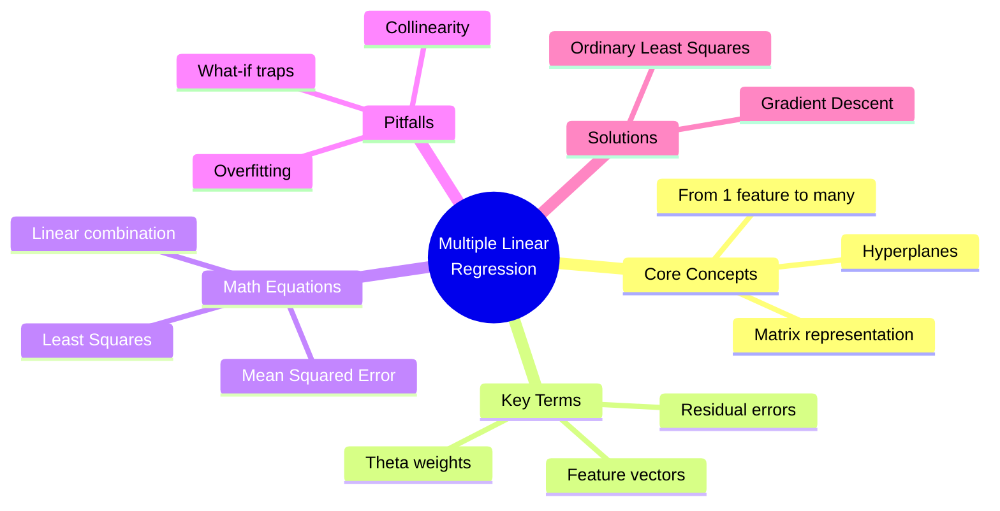

---

## 📚 Glossary: Key Terms & Definitions

### Core Terms

| Term | Symbol | Definition | Intuition |
|------|--------|------------|-----------|
| **Dependent Variable** | y | The output we want to predict | The "answer" we're looking for (CO2 emissions) |
| **Independent Variables** | x₁, x₂, x₃... | Input features used for prediction | The "clues" we use (engine size, cylinders, fuel) |
| **Weights/Coefficients** | θ (theta) | Numbers that show importance of each feature | How much each clue matters |
| **Intercept/Bias** | θ₀ | Baseline value when all features are zero | Starting point before any features kick in |
| **Feature Vector** | X | Collection of all input features as a matrix | Organized container of all clues |
| **Residual Error** | e | Difference between actual and predicted value | How far off our guess was |
| **Mean Squared Error (MSE)** | MSE | Average of all squared residual errors | Overall "wrongness" score |

### Advanced Terms

| Term | Definition | Why It Matters |
|------|------------|----------------|
| **Overfitting** | Model memorizes training data instead of learning patterns | Fails on new, unseen data |
| **Collinearity** | Two or more features are correlated with each other | They predict each other, causing confusion |
| **Hyperplane** | Extension of a line/plane to higher dimensions | What the model looks like with 3+ features |
| **Ordinary Least Squares (OLS)** | Method to find best weights using linear algebra | Fast, exact solution for small datasets |
| **Gradient Descent** | Iterative optimization to find best weights | Works better for large datasets |
| **What-if Scenario** | Changing one input to see predicted outcome change | Useful for decision-making |

---

## 🔄 Simple vs Multiple Linear Regression

### The Core Difference

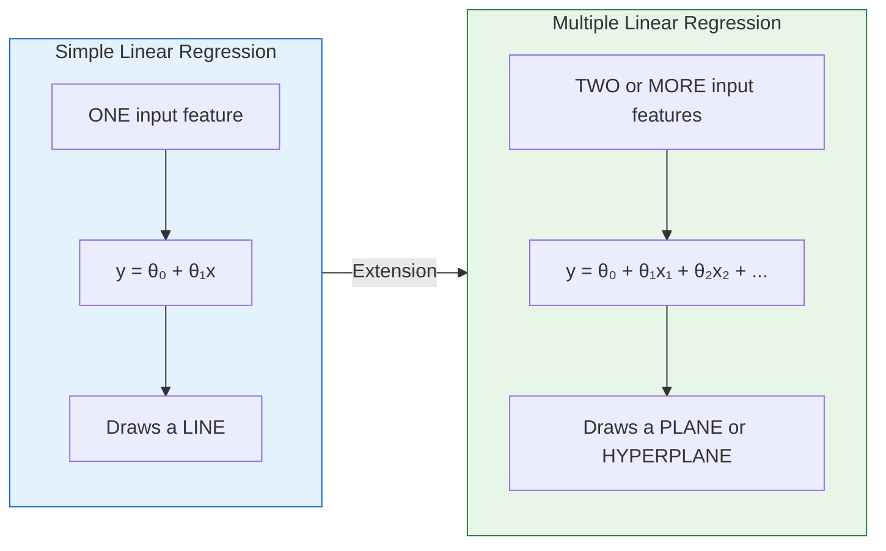

### Visual Comparison

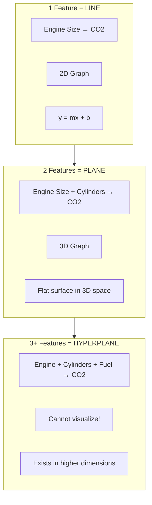

### Why Multiple is Better?

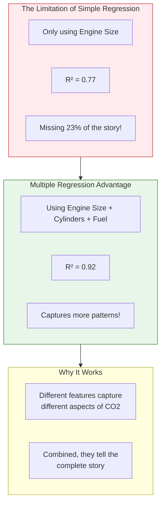

---

## 🧮 The Math: Equations Explained Intuitively

### The Core Equation

$$\hat{y} = \theta_0 + \theta_1 x_1 + \theta_2 x_2 + \theta_3 x_3 + ... + \theta_n x_n$$

### Breaking It Down Piece by Piece

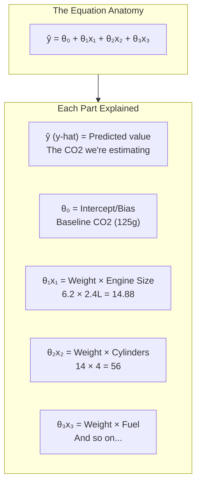

### The Recipe Analogy 🍳

Think of multiple linear regression like a recipe:

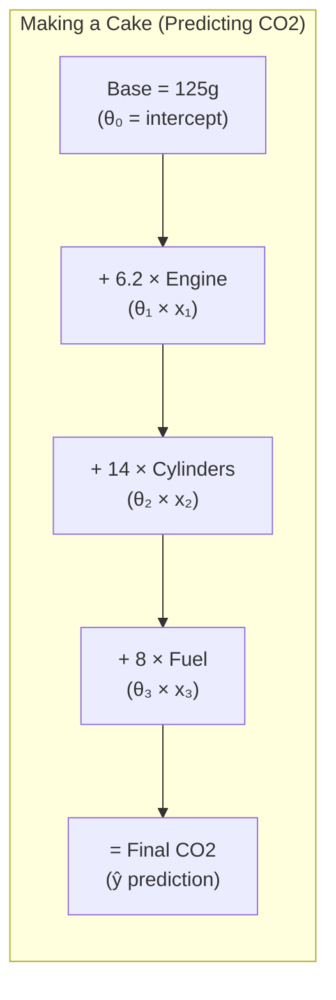

**The Intuition:**
- Each ingredient (feature) contributes to the final dish (prediction)
- The weight (θ) tells you how MUCH of each ingredient to add
- Some ingredients matter more (larger θ) than others

### Real Example Walkthrough

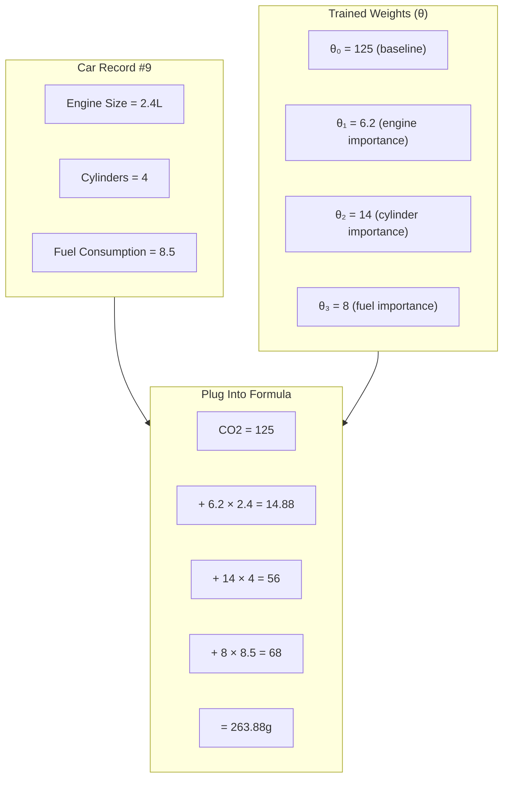

---

## 📐 Matrix Representation: Organizing the Math

### Why Use Matrices?

When you have thousands of cars and multiple features, writing individual equations is impractical. Matrices organize everything neatly.

### The Matrix Form

$$\hat{y} = X \cdot \theta$$

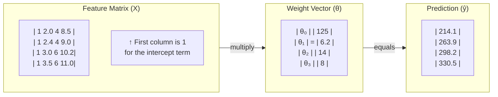

### Why the Column of Ones?

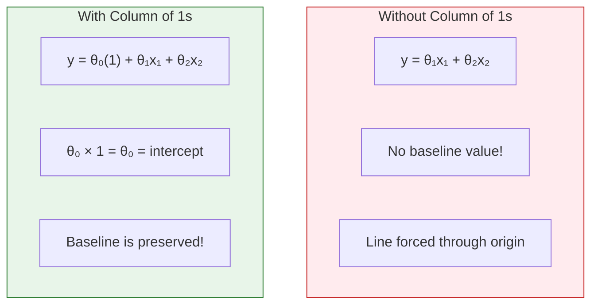

**The Trick:** Multiplying θ₀ by 1 gives us θ₀ — the intercept term stays in the matrix equation!

---

## 📉 Understanding Error: How Wrong Are We?

### Residual Error

The difference between what we predicted and what actually happened.

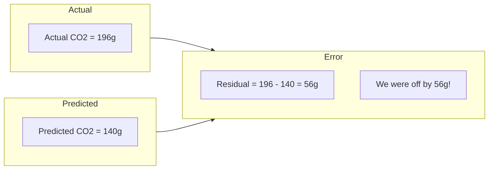

### Mean Squared Error (MSE)

$$MSE = \frac{1}{n} \sum_{i=1}^{n} (y_i - \hat{y}_i)^2$$

### Breaking Down MSE Step by Step

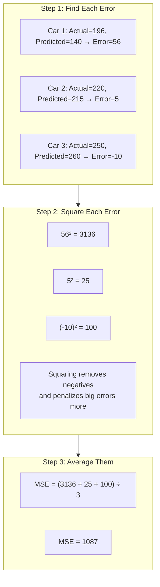

### Why Square the Errors?

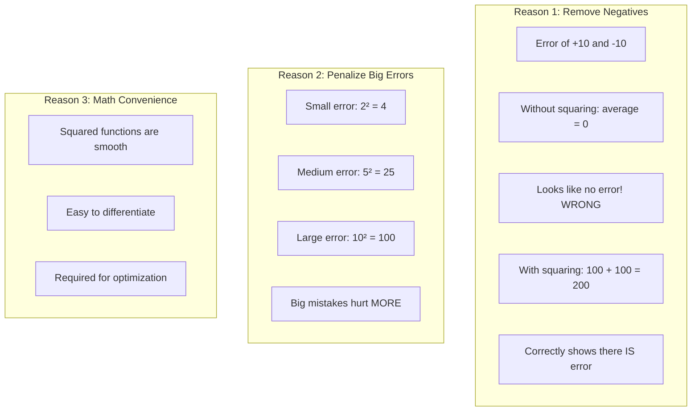

---

## 🎯 Finding the Best Weights: Two Approaches

### The Goal

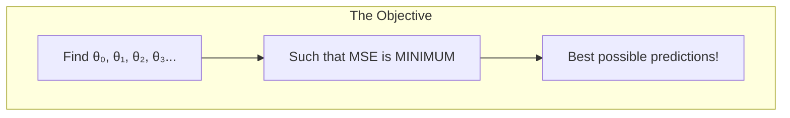

### Method 1: Ordinary Least Squares (OLS)

**What it is:** A direct mathematical formula that calculates the exact optimal weights in one shot.

$$\theta = (X^T X)^{-1} X^T y$$

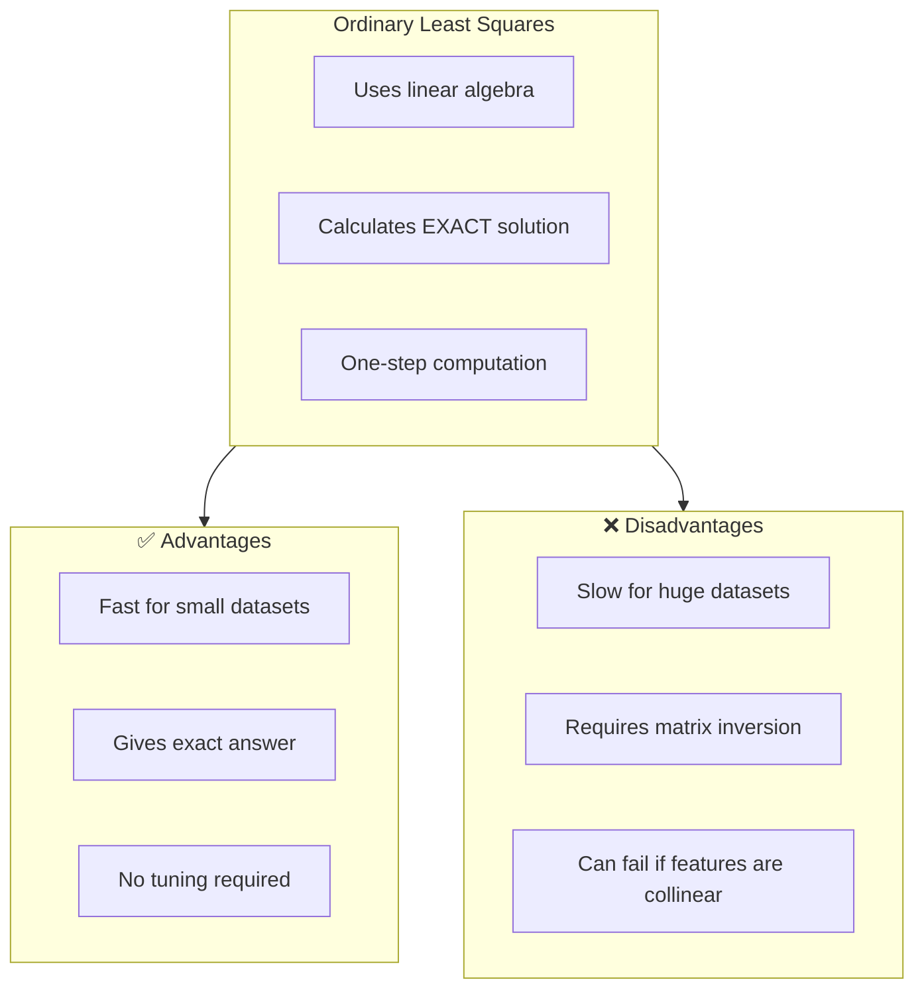

### Method 2: Gradient Descent

**What it is:** An iterative approach that slowly improves the weights step by step.

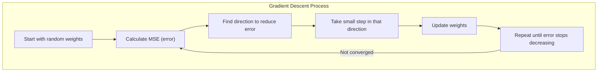

### The Hill Climbing Analogy

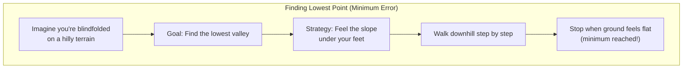

### When to Use Which?

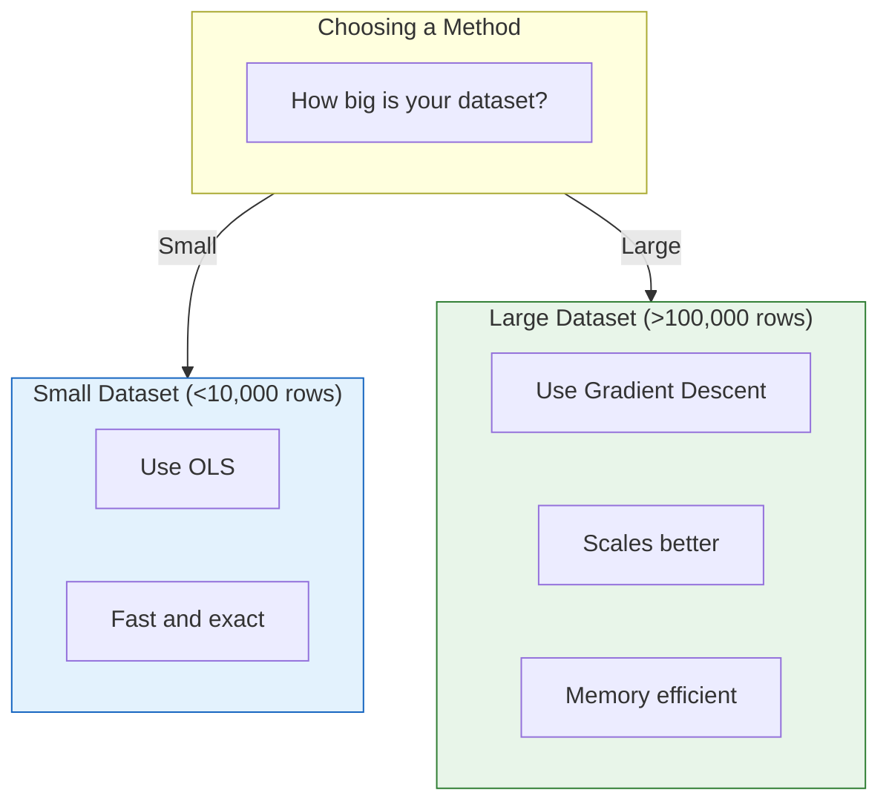

---

## ⚠️ Pitfall #1: Overfitting

### What Is Overfitting?

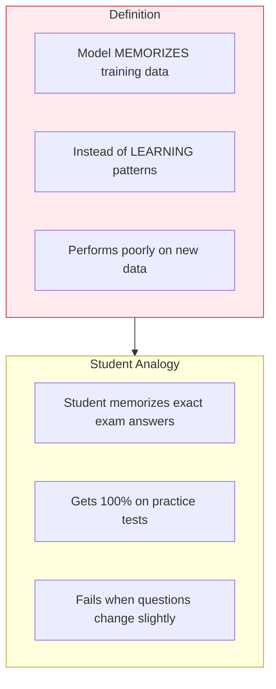

### How Does It Happen in Multiple Regression?

```mermaid
flowchart LR
    subgraph TooFew["Too Few Features"]
        TF1["Underfitting"]
        TF2["Misses important patterns"]
        TF3["High bias"]
    end
    
    subgraph JustRight["Right Number of Features"]
        JR1["Good generalization"]
        JR2["Captures true patterns"]
        JR3["Works on new data"]
    end
    
    subgraph TooMany["Too Many Features"]
        TM1["Overfitting"]
        TM2["Memorizes noise"]
        TM3["High variance"]
    end
    
    TooFew --> JustRight --> TooMany
    
    style TooFew fill:#fff3e0,stroke:#ef6c00
    style JustRight fill:#e8f5e9,stroke:#2e7d32
    style TooMany fill:#ffebee,stroke:#c62828
```

### Detecting Overfitting

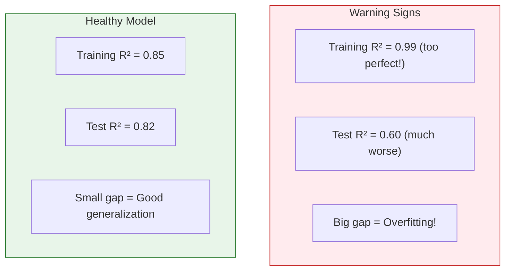

---

## ⚠️ Pitfall #2: Collinearity (Correlated Features)

### What Is Collinearity?

```mermaid
flowchart TB
    subgraph Definition
        D1["Two features that predict EACH OTHER"]
        D2["They move together"]
        D3["Redundant information"]
    end
    
    subgraph Example["Example"]
        E1["City Fuel Consumption"]
        E2["Highway Fuel Consumption"]
        E3["If one is high, other is usually high too!"]
        E1 <-->|"Correlated"| E2
    end
```

### Why Is Collinearity Bad?

```mermaid
flowchart TB
    subgraph Problem1["Problem 1: Unstable Weights"]
        P1A["Small data changes"]
        P1B["Cause HUGE weight changes"]
        P1C["Unreliable model"]
    end
    
    subgraph Problem2["Problem 2: Misleading Importance"]
        P2A["Can't tell which feature matters"]
        P2B["They're stealing credit from each other"]
    end
    
    subgraph Problem3["Problem 3: What-If Fails"]
        P3A["Change one correlated variable"]
        P3B["Other MUST also change"]
        P3C["Can't isolate individual effects"]
    end
```

### The Solution

```mermaid
flowchart TB
    subgraph Detect["Step 1: Detect Correlation"]
        D1["Calculate correlation between all features"]
        D2["Look for values close to +1 or -1"]
    end
    
    subgraph Remove["Step 2: Remove Redundancy"]
        R1["Keep ONE of the correlated features"]
        R2["Remove the others"]
        R3["Or combine them into one feature"]
    end
    
    subgraph Select["Step 3: Smart Selection"]
        S1["Choose features that are:"]
        S2["- Uncorrelated with each other"]
        S3["- Highly correlated with TARGET"]
        S4["- Understandable and controllable"]
    end
    
    Detect --> Remove --> Select
```

---

## 🔮 What-If Scenarios: Predicting Changes

### What Are What-If Scenarios?

```mermaid
flowchart LR
    subgraph Question
        Q["What if we change ONE input?"]
    end
    
    subgraph Example
        E1["Current: Engine = 2.0L → CO2 = 200g"]
        E2["What if: Engine = 3.0L → CO2 = ???"]
    end
    
    subgraph Answer
        A["Model predicts new CO2 based on<br/>the learned relationship"]
    end
    
    Question --> Example --> Answer
```

### Real-World Applications

```mermaid
flowchart TB
    subgraph Healthcare["Healthcare"]
        H1["Input: BMI change"]
        H2["Predict: Blood pressure change"]
    end
    
    subgraph Education["Education"]
        ED1["Input: More study hours"]
        ED2["Predict: Exam score improvement"]
    end
    
    subgraph Business["Business"]
        B1["Input: Increase ad spending"]
        B2["Predict: Sales increase"]
    end
    
    subgraph Environment["Environment"]
        EN1["Input: Larger engine"]
        EN2["Predict: CO2 emission increase"]
    end
```

### ⚠️ When What-If Scenarios Fail

```mermaid
flowchart TB
    subgraph Trap1["Trap 1: Impossible Scenarios"]
        T1A["What if engine size = 50L?"]
        T1B["No such car exists!"]
        T1C["Prediction is meaningless"]
    end
    
    subgraph Trap2["Trap 2: Extrapolation"]
        T2A["Model trained on engines 1-5L"]
        T2B["Asking about 10L engine"]
        T2C["Outside training range = unreliable"]
    end
    
    subgraph Trap3["Trap 3: Ignoring Correlations"]
        T3A["Change engine size alone"]
        T3B["But cylinders usually change too!"]
        T3C["Unrealistic scenario"]
    end
    
    style Trap1 fill:#ffebee,stroke:#c62828
    style Trap2 fill:#ffebee,stroke:#c62828
    style Trap3 fill:#ffebee,stroke:#c62828
```

---

## 🔢 Handling Categorical Variables

### The Problem

Regression needs NUMBERS, but some features are CATEGORIES.

```mermaid
flowchart LR
    subgraph Categorical["Categorical Data"]
        C1["Car Type: Manual, Automatic"]
        C2["Color: Red, Blue, Green"]
        C3["Brand: Toyota, Honda, Ford"]
    end
    
    subgraph Problem
        P["Regression can't use words!"]
    end
    
    Categorical --> Problem
```

### Solution 1: Binary Encoding (Two Categories)

```mermaid
flowchart LR
    subgraph Before["Before"]
        B1["Manual"]
        B2["Automatic"]
    end
    
    subgraph After["After"]
        A1["0"]
        A2["1"]
    end
    
    B1 -->|"encode"| A1
    B2 -->|"encode"| A2
```

### Solution 2: One-Hot Encoding (Multiple Categories)

```mermaid
flowchart TB
    subgraph Before["Before: Color Column"]
        B["Red, Blue, Green, Red, Blue"]
    end
    
    subgraph After["After: Three Binary Columns"]
        A1["is_Red:   1, 0, 0, 1, 0"]
        A2["is_Blue:  0, 1, 0, 0, 1"]
        A3["is_Green: 0, 0, 1, 0, 0"]
    end
    
    Before --> After
```

### Example with Car Type

| Original | Encoded |
|----------|---------|
| Manual | 0 |
| Automatic | 1 |
| Manual | 0 |
| Automatic | 1 |

Now the model can use: `CO2 = θ₀ + θ₁(Engine) + θ₂(CarType)`

Where CarType is 0 or 1!

---

## 🏗️ Building a Good Model: Feature Selection

### The Balancing Act

```mermaid
flowchart TB
    subgraph Goal["The Goal"]
        G["Select features that:"]
    end
    
    subgraph Criteria["Selection Criteria"]
        C1["✅ Uncorrelated with EACH OTHER<br/>(avoid collinearity)"]
        C2["✅ Highly correlated with TARGET<br/>(good predictors)"]
        C3["✅ Understandable<br/>(interpretable)"]
        C4["✅ Controllable<br/>(useful for what-if)"]
    end
    
    Goal --> Criteria
```

### The Feature Selection Process

```mermaid
flowchart TB
    subgraph Step1["Step 1: List All Candidates"]
        S1["Engine Size, Cylinders, Fuel City,<br/>Fuel Highway, Fuel Combined,<br/>Weight, Horsepower, ..."]
    end
    
    subgraph Step2["Step 2: Check Correlations"]
        S2A["With target (want HIGH)"]
        S2B["With each other (want LOW)"]
    end
    
    subgraph Step3["Step 3: Remove Redundant"]
        S3["Fuel City & Fuel Highway → Keep only Fuel Combined"]
    end
    
    subgraph Step4["Step 4: Final Selection"]
        S4["Engine Size + Cylinders + Fuel Combined"]
    end
    
    Step1 --> Step2 --> Step3 --> Step4
```

---

## 📊 Geometric Interpretation: Lines, Planes, Hyperplanes

### How Dimensions Grow

```mermaid
flowchart LR
    subgraph One["1 Feature"]
        O1["Regression finds a LINE"]
        O2["2D space (x, y)"]
    end
    
    subgraph Two["2 Features"]
        T1["Regression finds a PLANE"]
        T2["3D space (x₁, x₂, y)"]
    end
    
    subgraph Three["3+ Features"]
        TH1["Regression finds a HYPERPLANE"]
        TH2["Cannot visualize!"]
        TH3["But math still works"]
    end
    
    One --> Two --> Three
```

### Visual Intuition

```mermaid
flowchart TB
    subgraph Line["LINE (1 feature)"]
        L["y<br/>│      /<br/>│    /<br/>│  /<br/>│/<br/>└────── x"]
    end
    
    subgraph Plane["PLANE (2 features)"]
        P["Imagine a flat sheet of paper<br/>tilted in 3D space<br/>Any point on sheet = prediction"]
    end
    
    subgraph Hyper["HYPERPLANE (3+ features)"]
        H["Mathematical object in n-dimensions<br/>Still 'flat' (linear)<br/>Just can't draw it!"]
    end
```

---

## 🎓 Complete Example: Predicting CO2

### The Setup

```mermaid
flowchart TB
    subgraph Features["Input Features (X)"]
        F1["x₁ = Engine Size (2.4L)"]
        F2["x₂ = Cylinders (4)"]
        F3["x₃ = Fuel Consumption (8.5)"]
    end
    
    subgraph Weights["Trained Weights (θ)"]
        W0["θ₀ = 125 (intercept)"]
        W1["θ₁ = 6.2"]
        W2["θ₂ = 14"]
        W3["θ₃ = 8"]
    end
    
    subgraph Target["Target (y)"]
        T["CO2 Emissions = ???"]
    end
    
    Features --> Target
    Weights --> Target
```

### The Calculation

```mermaid
flowchart TB
    subgraph Formula["The Formula"]
        F["CO2 = θ₀ + θ₁×Engine + θ₂×Cylinders + θ₃×Fuel"]
    end
    
    subgraph Substitution["Plug In Values"]
        S1["CO2 = 125 + 6.2×2.4 + 14×4 + 8×8.5"]
    end
    
    subgraph Calculation["Calculate"]
        C1["= 125 + 14.88 + 56 + 68"]
        C2["= 263.88"]
    end
    
    subgraph Result["Final Prediction"]
        R["Predicted CO2 = 263.88g"]
    end
    
    Formula --> Substitution --> Calculation --> Result
```

### Interpreting the Weights

| Weight | Value | Interpretation |
|--------|-------|----------------|
| θ₁ = 6.2 | Engine Size | Each 1L increase → 6.2g more CO2 |
| θ₂ = 14 | Cylinders | Each extra cylinder → 14g more CO2 |
| θ₃ = 8 | Fuel | Each L/100km increase → 8g more CO2 |

**Insight:** Cylinders have the BIGGEST impact (14 per unit) on CO2 among these features!

---

## ⚖️ Comparing Models: Relative Importance

### How Weights Show Feature Importance

```mermaid
flowchart TB
    subgraph Caution["⚠️ Caution!"]
        C1["Raw weights can be MISLEADING"]
        C2["Different features have different SCALES"]
        C3["Must STANDARDIZE to compare fairly"]
    end
    
    subgraph Example["Example Problem"]
        E1["Engine size: 1-5L (small numbers)"]
        E2["Horsepower: 100-400 (large numbers)"]
        E3["Weights will be different scales!"]
    end
    
    subgraph Solution["Solution: Standardize"]
        S1["Convert all features to same scale"]
        S2["Then compare weights fairly"]
    end
    
    Caution --> Example --> Solution
```

---

## 📝 Quick Reference: Formula Cheat Sheet

### All Key Equations

| Name | Formula | Purpose |
|------|---------|---------|
| **Prediction** | ŷ = θ₀ + θ₁x₁ + θ₂x₂ + ... | Calculate predicted value |
| **Matrix Form** | ŷ = Xθ | Compact notation |
| **Residual** | eᵢ = yᵢ - ŷᵢ | Error for one sample |
| **MSE** | (1/n)Σ(yᵢ - ŷᵢ)² | Average squared error |
| **OLS Solution** | θ = (XᵀX)⁻¹Xᵀy | Direct weight calculation |

### Symbol Reference

| Symbol | Name | Meaning |
|--------|------|---------|
| ŷ | y-hat | Predicted value |
| θ | theta | Weight/coefficient |
| X | X matrix | Feature matrix |
| Xᵀ | X transpose | Rows ↔ columns swapped |
| ⁻¹ | inverse | Matrix inverse |
| Σ | sigma | Sum of all |

---

## 🎯 Key Takeaways

```mermaid
mindmap
  root((Multiple Linear<br/>Regression))
    What It Is
      Extension of simple regression
      Uses 2+ features
      Linear combination of weights
    The Math
      y = θ₀ + θ₁x₁ + θ₂x₂ + ...
      Minimize MSE
      Find optimal θ values
    Methods
      OLS for small data
      Gradient Descent for large data
    Pitfalls
      Overfitting with too many features
      Collinearity between features
      What-if traps
    Best Practices
      Select uncorrelated features
      Encode categorical variables
      Validate on test data
```

---

## 🚦 When to Use What

```mermaid
flowchart TB
    subgraph Question["What's Your Situation?"]
        Q1["How many features?"]
        Q2["What's the relationship?"]
    end
    
    subgraph OneFeature["1 Feature, Linear"]
        O["Use Simple Linear Regression"]
    end
    
    subgraph MultiFeature["2+ Features, Linear"]
        M["Use Multiple Linear Regression"]
    end
    
    subgraph NonLinear["Curved Relationship"]
        N["Use Polynomial or<br/>Other Non-linear Models"]
    end
    
    subgraph Category["Predicting Categories"]
        C["Use Classification<br/>(Not Regression!)"]
    end
    
    Question --> OneFeature
    Question --> MultiFeature
    Question --> NonLinear
    Question --> Category
```

---

## 🔗 Connection to Simple Linear Regression

```mermaid
flowchart TB
    subgraph Simple["Simple Linear Regression"]
        S1["y = θ₀ + θ₁x"]
        S2["1 feature"]
        S3["Finds a line"]
    end
    
    subgraph Multiple["Multiple Linear Regression"]
        M1["y = θ₀ + θ₁x₁ + θ₂x₂ + ..."]
        M2["2+ features"]
        M3["Finds a plane/hyperplane"]
    end
    
    subgraph Same["What Stays the Same"]
        SA1["Goal: Minimize MSE"]
        SA2["Linear relationship assumed"]
        SA3["Train/test split needed"]
        SA4["Weights show importance"]
    end
    
    Simple -->|"Extension"| Multiple
    Simple --> Same
    Multiple --> Same
    
    style Same fill:#e8f5e9,stroke:#2e7d32
```

---

> 💡 **Remember:** Multiple Linear Regression is powerful, but with great power comes great responsibility. Choose features wisely, watch for collinearity, and always validate on unseen data!

---

*Building on Simple Linear Regression — Now You Have More Tools! 🛠️*