# 🚗 Simple Linear Regression: Predicting CO2 Emissions

> **The Big Question:** Can we predict how much CO2 a car emits just by knowing its engine size?

---

## 📖 The Story Behind This Note

Imagine you work for an environmental agency. Your boss walks in and asks:

> "We need to estimate CO2 emissions for thousands of cars, but we only have their engine specifications. Can you build something that predicts emissions automatically?"

This is exactly what **Simple Linear Regression** helps us do — find a mathematical relationship between two things so we can predict one from the other.

---

## 🎯 What You'll Learn

```mermaid
mindmap
  root((Simple Linear Regression))
    What is it?
      Drawing the best fit line
      Predicting unknown values
    The Math
      Slope and Intercept
      The magic equation y = mx + b
    The Process
      Splitting data
      Training the model
      Testing predictions
    Evaluation
      How good is our model?
      MAE, MSE, RMSE, R²
    Feature Selection
      Which input works best?
```



---

## 🧠 Part 1: The Intuition — What is Linear Regression?

### The Coffee Shop Analogy

Imagine you run a coffee shop and notice something:

| Customers | Coffees Sold |
|-----------|--------------|
| 10 | 15 |
| 20 | 32 |
| 30 | 45 |
| 40 | 61 |
| 50 | 74 |

You see a **pattern** — more customers means more coffee sold. But can you predict exactly how many coffees you'll sell if 35 customers walk in?

**This is regression!** Finding the hidden pattern and using it to predict.

### Visual Intuition


### What "Linear" Means

**Linear = Straight Line**

We assume the relationship between input (X) and output (Y) can be drawn as a straight line.


The points roughly follow a diagonal line — that's a **linear relationship**!

---

## 📊 Part 2: Understanding Our Data

### The Dataset

We have car data with multiple features:


### The Question We're Asking


---

## 🔢 Part 3: The Magic Equation

### The Formula That Powers Everything

Every straight line can be described by one simple equation:

$$y = mx + b$$

Let's break this down:

| Symbol | Name | What It Means | In Our Problem |
|--------|------|---------------|----------------|
| **y** | Prediction | The output we want | CO2 Emissions |
| **x** | Input | The value we know | Engine Size |
| **m** | Slope (Coefficient) | How steep the line is | 39.28 |
| **b** | Intercept | Where line crosses y-axis | 125.65 |

### What Do Slope and Intercept Actually Mean?


### Prediction in Action

```mermaid
flowchart LR
    subgraph Formula
        F["CO2 = 39.28 × Engine + 125.65"]
    end
    
    subgraph Example1["Example 1"]
        E1["Engine = 2.0L"]
        R1["CO2 = 39.28 × 2.0 + 125.65"]
        A1["= 204.21 grams"]
        E1 --> R1 --> A1
    end
    
    subgraph Example2["Example 2"]
        E2["Engine = 4.0L"]
        R2["CO2 = 39.28 × 4.0 + 125.65"]
        A2["= 282.77 grams"]
        E2 --> R2 --> A2
    end
    
    Formula --> Example1
    Formula --> Example2
```



---

## ✂️ Part 4: Why Split Data into Train and Test?

### The Student Exam Analogy

This is **the most important concept** to understand!

```mermaid
flowchart TB
    subgraph Wrong["❌ WRONG WAY: No Split"]
        W1["Student gets 100 practice problems"]
        W2["Student memorizes all answers"]
        W3["Exam has SAME 100 problems"]
        W4["Student scores 100%!"]
        W5["But did they LEARN? NO!"]
        W1 --> W2 --> W3 --> W4 --> W5
    end
    
    subgraph Right["✅ RIGHT WAY: With Split"]
        R1["Student gets 80 practice problems"]
        R2["Student learns the CONCEPTS"]
        R3["Exam has 20 NEW problems"]
        R4["Student scores 85%"]
        R5["This shows REAL understanding!"]
        R1 --> R2 --> R3 --> R4 --> R5
    end
    
    style Wrong fill:#ffebee,stroke:#c62828
    style Right fill:#e8f5e9,stroke:#2e7d32
```



### The Split Process


### What Are X_train, X_test, y_train, y_test?


### The Random State Mystery

When splitting data, Python shuffles it randomly. But what if you want **reproducible results**?

```mermaid
flowchart TB
    subgraph Without["Without random_state"]
        N1["Run 1: Train gets cars A,C,E,G"]
        N2["Run 2: Train gets cars B,D,F,H"]
        N3["Run 3: Train gets cars A,D,E,H"]
        N4["Different results every time! 😫"]
        N1 --> N4
        N2 --> N4
        N3 --> N4
    end
    
    subgraph With["With random_state=42"]
        W1["Run 1: Train gets cars A,C,E,G"]
        W2["Run 2: Train gets cars A,C,E,G"]
        W3["Run 3: Train gets cars A,C,E,G"]
        W4["Same results every time! 😊"]
        W1 --> W4
        W2 --> W4
        W3 --> W4
    end
    
    style Without fill:#ffebee,stroke:#c62828
    style With fill:#e8f5e9,stroke:#2e7d32
```



> 💡 **Why 42?** It's just a tradition from "The Hitchhiker's Guide to the Galaxy" — you can use any number!

---

## 🏋️ Part 5: Training the Model

### The Training Process

```mermaid
sequenceDiagram
    participant D as Data Scientist
    participant M as Model
    participant T as Training Data
    
    D->>M: Create empty model
    Note over M: model = LinearRegression()
    
    D->>M: Here's the training data
    M->>T: Let me look at X_train and y_train
    
    T-->>M: Engine=2.0 → CO2=196
    T-->>M: Engine=3.0 → CO2=245
    T-->>M: Engine=2.5 → CO2=220
    T-->>M: ... (800 more examples)
    
    M->>M: Finding best line...
    Note over M: Minimize total error
    
    M-->>D: Done! Found: y = 39.28x + 125.65
    Note over D: Slope=39.28, Intercept=125.65
```



### Why Reshape? The Technical Detail

```mermaid
flowchart TB
    subgraph Before["Before: 1D Array"]
        B["[2.0, 1.5, 3.2, 2.8, 1.9]"]
        BS["Shape: (5,) ❌"]
    end
    
    subgraph After["After: 2D Array"]
        A["[[2.0],<br/>[1.5],<br/>[3.2],<br/>[2.8],<br/>[1.9]]"]
        AS["Shape: (5, 1) ✅"]
    end
    
    Before -->|"reshape(-1, 1)"| After
    
    subgraph Why["Why 2D?"]
        W["sklearn expects 2D because<br/>you might have MULTIPLE features"]
    end
    
    After --> Why
    
    style Before fill:#ffebee,stroke:#c62828
    style After fill:#e8f5e9,stroke:#2e7d32
```



---

## 📐 Part 6: Model Evaluation — How Good Is Our Model?

### The Core Idea


### The Four Evaluation Metrics

```mermaid
flowchart TB
    subgraph MAE["MAE: Mean Absolute Error"]
        MAE1["Average of |errors|"]
        MAE2["(|4| + |5| + |10|) ÷ 3 = 6.33"]
        MAE3["✅ Easy to understand"]
        MAE4["✅ Same units as data"]
    end
    
    subgraph MSE["MSE: Mean Squared Error"]
        MSE1["Average of errors²"]
        MSE2["(16 + 25 + 100) ÷ 3 = 47"]
        MSE3["✅ Penalizes big errors more"]
        MSE4["❌ Units are squared"]
    end
    
    subgraph RMSE["RMSE: Root Mean Squared Error"]
        RMSE1["Square root of MSE"]
        RMSE2["√47 = 6.86"]
        RMSE3["✅ Same units as data"]
        RMSE4["✅ Still penalizes big errors"]
    end
    
    subgraph R2["R² Score"]
        R21["How much variance explained?"]
        R22["0 to 1 (1 = perfect)"]
        R23["✅ Easy to compare models"]
        R24["✅ Percentage interpretation"]
    end
```



### Understanding Each Metric

#### Mean Absolute Error (MAE)

```mermaid
flowchart LR
    subgraph Data
        D1["Actual: 200, 220, 250"]
        D2["Predicted: 195, 230, 245"]
    end
    
    subgraph Errors
        E1["Errors: -5, +10, -5"]
        E2["Absolute: 5, 10, 5"]
    end
    
    subgraph Result
        R["MAE = (5+10+5)÷3 = 6.67"]
        I["'On average, we're off by 6.67 units'"]
    end
    
    Data --> Errors --> Result
```



#### Mean Squared Error (MSE)

```mermaid
flowchart LR
    subgraph Errors
        E["Errors: -5, +10, -5"]
    end
    
    subgraph Squared
        S["Squared: 25, 100, 25"]
        N["Note: 10² = 100 (BIG penalty!)"]
    end
    
    subgraph Result
        R["MSE = (25+100+25)÷3 = 50"]
    end
    
    Errors --> Squared --> Result
```



> 💡 **Why Square?** An error of 10 gets penalized 4x more than an error of 5 (100 vs 25). This is useful when big mistakes are much worse than small ones!

#### R² Score — The Most Intuitive


### R² Score Interpretation Guide

```mermaid
flowchart LR
    subgraph Excellent
        E["R² = 0.90 - 1.00"]
        E1["Excellent fit!"]
    end
    
    subgraph Good
        G["R² = 0.70 - 0.89"]
        G1["Good model"]
    end
    
    subgraph Moderate
        M["R² = 0.50 - 0.69"]
        M1["Acceptable"]
    end
    
    subgraph Weak
        W["R² = 0.30 - 0.49"]
        W1["Weak, need better features"]
    end
    
    subgraph Poor
        P["R² < 0.30"]
        P1["Poor, rethink approach"]
    end
    
    Excellent --> Good --> Moderate --> Weak --> Poor
    
    style Excellent fill:#c8e6c9,stroke:#2e7d32
    style Good fill:#dcedc8,stroke:#558b2f
    style Moderate fill:#fff9c4,stroke:#f9a825
    style Weak fill:#ffe0b2,stroke:#ef6c00
    style Poor fill:#ffcdd2,stroke:#c62828
```



---

## 🔍 Part 7: Variance — Why Should We Care?

### What Is Variance?

**Variance = How spread out the data is from the average**

```mermaid
flowchart TB
    subgraph LowVar["Low Variance"]
        L1["Values: 248, 250, 252, 250, 250"]
        L2["All values CLOSE to mean (250)"]
        L3["Data is CONSISTENT"]
    end
    
    subgraph HighVar["High Variance"]
        H1["Values: 150, 200, 250, 300, 350"]
        H2["Values SPREAD from mean (250)"]
        H3["Data is SCATTERED"]
    end
    
    style LowVar fill:#e3f2fd,stroke:#1565c0
    style HighVar fill:#fff3e0,stroke:#ef6c00
```

### Why Variance Matters for R²
What is variance telling us about our model? 
- Variance shows how much the CO2 values differ overall (Total Variance).
- Our model tries to explain as much of that variance as possible (Explained Variance).
- The rest is left unexplained (Unexplained Variance).
- R² score measures the proportion of variance our model explains.
- The higher the R², the better our model captures the variance in CO2 emissions.
- So, in short, variance helps us understand how well our model is performing!
- In simple terms, variance is the "spread" of CO2 values, and R² tells us how much of that spread our model can account for.

```mermaid
flowchart TB
    subgraph Total["Total Variance"]
        T["How much CO2 values naturally differ"]
        T1["Some cars emit 150g, others 350g"]
        T2["WHY this difference?"]
    end
    
    subgraph Explained["Explained Variance"]
        E["Variance our model captures"]
        E1["Engine size explains most of it!"]
    end
    
    subgraph Unexplained["Unexplained Variance"]
        U["Variance we CAN'T explain"]
        U1["Other factors: weight, drag, etc."]
    end
    
    Total --> Explained
    Total --> Unexplained
    
    subgraph R2["R² Score"]
        R["R² = Explained ÷ Total"]
        R1["Higher R² = Model explains more"]
    end
    
    Explained --> R2
    Total --> R2
```

---

## 🏆 Part 8: Feature Selection — Which Input is Best?

### The Experiment

We test each feature separately and compare how well they predict CO2:

```mermaid
flowchart TB
    subgraph Features["Available Features"]
        F1["ENGINESIZE"]
        F2["CYLINDERS"]
        F3["FUELCONSUMPTION_CITY"]
        F4["FUELCONSUMPTION_HWY"]
        F5["FUELCONSUMPTION_COMB"]
    end
    
    subgraph Process["For Each Feature"]
        P1["Train separate model"]
        P2["Calculate R² score"]
        P3["Compare results"]
    end
    
    subgraph Winner["Best Feature"]
        W["FUELCONSUMPTION_COMB"]
        W1["R² = 0.87 (87% explained!)"]
    end
    
    Features --> Process --> Winner
```

### Results Ranking

```mermaid
flowchart TB
    subgraph Ranking["Feature Ranking (Best to Worst)"]
        R1["🥇 FUELCONSUMPTION_COMB — R² = 0.87"]
        R2["🥈 FUELCONSUMPTION_CITY — R² = 0.85"]
        R3["🥉 FUELCONSUMPTION_HWY — R² = 0.83"]
        R4["4th ENGINESIZE — R² = 0.77"]
        R5["5th CYLINDERS — R² = 0.72"]
        
        R1 --> R2 --> R3 --> R4 --> R5
    end
    
    style R1 fill:#c8e6c9,stroke:#2e7d32
    style R2 fill:#dcedc8,stroke:#558b2f
    style R3 fill:#e8f5e9,stroke:#43a047
    style R4 fill:#fff9c4,stroke:#f9a825
    style R5 fill:#ffe0b2,stroke:#ef6c00
```

### Why Fuel Consumption Wins?

```mermaid
flowchart LR
    subgraph Indirect["Indirect Relationship"]
        I1["Engine Size"]
        I2["Cylinders"]
    end
    
    subgraph Direct["Direct Relationship"]
        D["Fuel Consumed"]
    end
    
    subgraph Output["Output"]
        O["CO2 Emissions"]
    end
    
    Indirect -->|"affects"| Direct -->|"directly causes"| Output
    
    subgraph Explanation
        E["More fuel burned = More CO2 released<br/>It's basic chemistry!"]
    end
    
    style Direct fill:#c8e6c9,stroke:#2e7d32
    style Indirect fill:#fff9c4,stroke:#f9a825
```

---

## ⚠️ Part 9: When to Use (and NOT Use) Linear Regression

### When to Use ✅

```mermaid
flowchart TB
    subgraph Use["✅ USE Linear Regression When:"]
        U1["Relationship looks like a straight line"]
        U2["Predicting a continuous number"]
        U3["You want interpretable results"]
        U4["Quick baseline model needed"]
        U5["Data has linear correlation"]
    end
    
    subgraph Examples["Good Examples"]
        E1["House price vs. square footage"]
        E2["Salary vs. years of experience"]
        E3["CO2 vs. fuel consumption"]
        E4["Test scores vs. study hours"]
    end
    
    Use --> Examples
    
    style Use fill:#e8f5e9,stroke:#2e7d32
```

### When NOT to Use ❌

```mermaid
flowchart TB
    subgraph DontUse["❌ DON'T USE Linear Regression When:"]
        D1["Relationship is curved"]
        D2["Predicting categories (yes/no)"]
        D3["Data has outliers"]
        D4["Features have complex interactions"]
        D5["Non-linear patterns visible"]
    end
    
    subgraph BadExamples["Bad Examples"]
        B1["Predicting if email is spam (use Classification)"]
        B2["Age vs. happiness (curved relationship)"]
        B3["Stock prices (too complex)"]
    end
    
    DontUse --> BadExamples
    
    style DontUse fill:#ffebee,stroke:#c62828
```

### Visual: Linear vs Non-Linear Data

```mermaid
flowchart LR
    subgraph Linear["✅ Linear Data"]
        L["Points follow straight line<br/>Use Linear Regression!"]
    end
    
    subgraph NonLinear["❌ Non-Linear Data"]
        N["Points follow curve<br/>Use Polynomial or other models"]
    end
    
    subgraph Scattered["❌ No Pattern"]
        S["Points are random<br/>No relationship exists!"]
    end
```

---

## 🔄 Part 10: The Complete Pipeline

### End-to-End Process

```mermaid
flowchart TB
    subgraph Step1["Step 1: Load Data"]
        L["Read CSV file into DataFrame"]
    end
    
    subgraph Step2["Step 2: Explore"]
        E1["View sample data"]
        E2["Check statistics"]
        E3["Visualize relationships"]
    end
    
    subgraph Step3["Step 3: Prepare"]
        P1["Select features (X)"]
        P2["Select target (y)"]
        P3["Split into train/test"]
    end
    
    subgraph Step4["Step 4: Train"]
        T1["Create model object"]
        T2["Fit on training data"]
        T3["Model learns slope & intercept"]
    end
    
    subgraph Step5["Step 5: Predict"]
        PR["Use model on test data"]
    end
    
    subgraph Step6["Step 6: Evaluate"]
        EV1["Calculate MAE, MSE, RMSE, R²"]
        EV2["Is model good enough?"]
    end
    
    subgraph Step7["Step 7: Decide"]
        D1["Yes → Deploy model"]
        D2["No → Try different features"]
    end
    
    Step1 --> Step2 --> Step3 --> Step4 --> Step5 --> Step6 --> Step7
    
    style Step1 fill:#e3f2fd,stroke:#1565c0
    style Step2 fill:#e8f5e9,stroke:#2e7d32
    style Step3 fill:#fff3e0,stroke:#ef6c00
    style Step4 fill:#f3e5f5,stroke:#7b1fa2
    style Step5 fill:#e0f2f1,stroke:#00695c
    style Step6 fill:#fce4ec,stroke:#c2185b
    style Step7 fill:#fff9c4,stroke:#f9a825
```

---

## 📝 Quick Reference Cheat Sheet

### Key Formulas

| Concept | Formula | Meaning |
|---------|---------|---------|
| **Prediction** | `y = mx + b` | Slope × Input + Intercept |
| **MAE** | `mean(\|actual - predicted\|)` | Average absolute error |
| **MSE** | `mean((actual - predicted)²)` | Average squared error |
| **RMSE** | `√MSE` | Root of MSE |
| **R²** | `1 - (unexplained/total)` | % variance explained |

### Code Snippets

```mermaid
flowchart TB
    subgraph Import["1. Import"]
        I["from sklearn.linear_model import LinearRegression<br/>from sklearn.model_selection import train_test_split<br/>from sklearn.metrics import r2_score, mean_squared_error"]
    end
    
    subgraph Split["2. Split"]
        S["X_train, X_test, y_train, y_test = <br/>train_test_split(X, y, test_size=0.2, random_state=42)"]
    end
    
    subgraph Train["3. Train"]
        T["model = LinearRegression()<br/>model.fit(X_train.reshape(-1,1), y_train)"]
    end
    
    subgraph Predict["4. Predict & Evaluate"]
        P["y_pred = model.predict(X_test.reshape(-1,1))<br/>r2 = r2_score(y_test, y_pred)"]
    end
    
    Import --> Split --> Train --> Predict
```

---

## 🎯 Key Takeaways

```mermaid
mindmap
  root((Key<br/>Takeaways))
    Linear Regression
      Finds best straight line
      y = mx + b equation
      Predicts continuous values
    Train Test Split
      Prevents memorization
      Tests on unseen data
      80/20 is common split
    Evaluation Metrics
      MAE for simplicity
      RMSE for penalizing big errors
      R² for overall quality
    Feature Selection
      Direct causes work best
      Compare R² scores
      Fuel consumption beats engine size
    When to Use
      Linear relationships only
      Continuous targets
      Interpretable results needed
```

---

## 🚀What's Next?

```mermaid
flowchart LR
    subgraph Current["You Are Here"]
        C["Simple Linear Regression<br/>(1 feature)"]
    end
    
    subgraph Next1["Next Steps"]
        N1["Multiple Linear Regression<br/>(Many features)"]
        N2["Polynomial Regression<br/>(Curved lines)"]
        N3["Regularization<br/>(Prevent overfitting)"]
    end
    
    subgraph Advanced["Advanced"]
        A1["Decision Trees"]
        A2["Random Forests"]
        A3["Neural Networks"]
    end
    
    Current --> Next1 --> Advanced
```

---

> 💡 **Remember:** Linear Regression is the foundation of machine learning. Master this, and everything else becomes easier to understand!

---